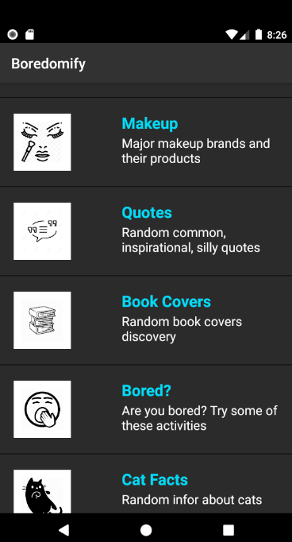
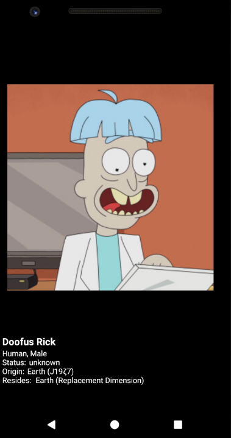

# Boredomify

A simple reader of random content from different public APIs. 

## How it works
Just select a category and click or swipe away for random content item under that category.

My toddler niece is currently excited about cats. The cats collection is a nice distruction when needed. 

**Some screenshots**

  

Some of the content included

- XKCD
- Rick and Morty characters
- Cat facts and cat images  
- General Trivia
- Math/Number facts 
- Jokes
- Book covers
- Popular inspiration quotes
- Makeup by popular brands 

## Credits
Visit [this page on git](https://github.com/public-apis/public-apis) for a list of public APIs. 